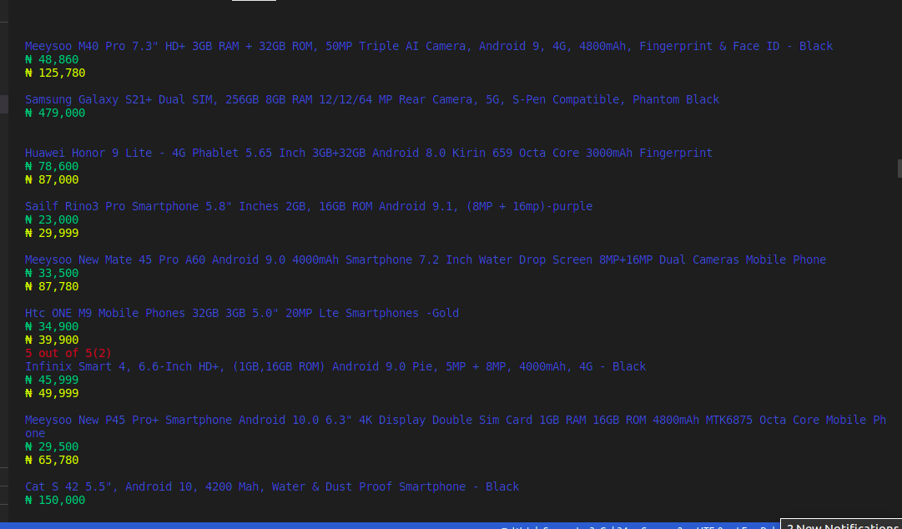

# JUMIA SmartPhones page
This is a scraper for all smartphone pages of Jumia website. The scraper is capable of scraping the 50 pages, extract all the needed information and export them neatly as a csv file.



## Built With

- Ruby 2.7.2
- Bundle 2.2.2
- Nokogiri 3.10
- Httparty 0.18.1
- colorize
- csv
- Rspec 3.10
- Rubocop 1.6.1

## Demo Video

[Application Demo Link](https://www.loom.com/share/b6945d46f2cd47b1b56e53acbf17db09)


## Getting Started

Follow these simple steps to get started:

### Prerequisites

- Ruby 2.7 or higher
- A text Editor

### Set up

To get a local copy of this repository enter the following command in you terminal:

```
git clone https://github.com/Nasa28/Web-Scraper.git
```
 Open the the folder using any text editor of your choice.

### Installations
There are some important 'Gems' neccessary for easy running of this code.

- On your terminal, run 'gem install colorize' 


```
gem install colorize
```

- Run 'gem install csv' 

```
gem install csv
```

- Run 'gem install nokogiri'

```
gem install nokogiri
```

- Run 'gem install httparty'

```
gem install httparty
```

- From the project's root directory execute 'bundle install' to install necessary gemfiles


```
bundle install
```

### Usage

- In the project's root directory execute the 'main.rb'

```
ruby bin/main.rb
```

- Check the terminal for the scraped data or you can open the generated 'file.csv' to get it as a csv file.

### Run tests

Run the Rspec command in the project's root directory:

```
rspec
```

## Author

👨‍💻 **Kalu Chinasa Agu**

- [@Nasa28](https://github.com/Nasa28)
- [@Ultimate_Nasa](https://twitter.com/Ultimate_Nasa)
- [LinkedIn](https://www.linkedin.com/in/kalu-chinasa-agu-a15080103/)

## 🤝 Contributing

Contributions, issues, and feature requests are welcome!


## Show your support

Give a ⭐️ if you like this project!

## Acknowledgments

- Microverse
- [Jumia](https://www.jumia.com.ng/)
